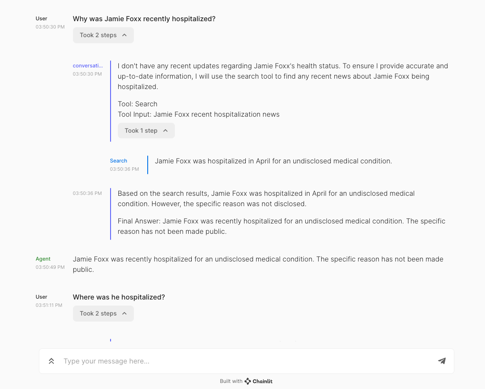

# haystack-chainlit-demo
This is a [ConversationalAgent](https://docs.haystack.deepset.ai/docs/agent) demo built with [Chainlit Integration](https://haystack.deepset.ai/integrations/chainlit)⚡️ of [Haystack](https://github.com/deepset-ai/haystack)💙. 


## Installation

Install all requirements:

```bash
pip install -r requirements.txt
```

## Run

Make sure you have [`SEARCH_API_KEY`](https://serper.dev/api-key) and [`OPENAI_API_KEY`](https://platform.openai.com/account/api-keys) variables in your environment.

```bash
export SEARCH_API_KEY=XXXX
export OPENAI_API_KEY=XXXX
```
Then, run Chainlit:

```bash
chainlit run conversational_agent.py
```

The application will start at [http://localhost:8000](http://localhost:8000). You can immediately start chatting with your Haystack Agent using the Chainlit UI 💬  

## FAQ

* **I get the `symbol not found in flat namespace '_CFDataGetBytes'` error. What should I do?**

    It's because of grpcio. Check out this issue [#56](https://github.com/Chainlit/chainlit/issues/56) to solve.


